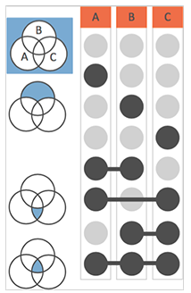

```{r setup, include=FALSE}
options(htmltools.dir.version = FALSE)
```


# Table of Contents

.large[
[dmrseq paper](#3)
<br>
<br>
[Applications of WGBS](#4)
<br>
<br>
[Methods limitation](#5)
<br>
<br>
[dmrseq](#8)
<br>
<br>
[Venn diagrams](#15)
]
---

class: left

<br>
<br>

# Detection and accurate false discovery rate control of differentially methylated regions from whole genome bisulfite sequencing

.blue[Keegan Korthauer, Sutirtha Chakraborty, Yuval Benjamini,] .red[Rafael A Irizarry]


<i>Biostatistics</i>, kxy007, https://doi.org/10.1093/biostatistics/kxy007

<b>Published:</b> 22 February 2018


---

class: left

# .center[Applications of WGBS]

<br>

- Detection of DMRs

- Detection of DMLs

- Detection of CNVs

- Detection of SNPs

- Detection of Cytosine methylation levels of TFBSs

---

class: left

# .center[Limitations of current methods]

- Methods are greatly hindered by low sample size. Most of the methods depends on large sample sizes.

--

- The number of tests performed = the number of loci analyzed.
<b>Example:</b> Human genome have ~30 million CpGs [1].

--

- Measurements are spatially correlated across the genome [2] (which is not accounted in most of the methods). Measurements from all loci are treated independently.

--

- Muliple testing corrections without considering the spatial correlation can result in a loss of power.

--

- <b>Biological interpretability:</b> most individual CpG loci likely do not have a large impact on epigenetic function on their own, but rather through a biochemical modification that involves several loci. Regional DNA methylation levels are correlated with the expression levels of nearby genes. Differentially expressed genes were consistently more likely to be located near DMRs than DMLs [3].

---

##.right[....cont.]

- DML approaches may construct DMRs by chaining together neighboring significant loci, this type of approach will not yield a proper assessment of the statistical significance of the constructed regions, nor will the FDR be properly controlled [4]. Controlling the FDR at the level of individual loci is not the same as controlling FDR of regions.

--

- FDR correction at the level of individual loci means that the proportion of expected false positive (FP) loci is controlled, not the proportion of FP regions. Statistically, this is a critical point since FDR control of DMR detection is not guaranteed under the DML setting.

--

- To perform inference at the region level, many tools: perform analysis on predefined regions of interest or fixed sliding windows. Though useful in targeted settings such as reduced representation bisulfite sequencing (RRBS), or when we have prior knowledge of the DMR size, they are not applicable to identifying DMRs of arbitrary size from WGBS.

--

- Challenges for assessing DMRs:
   - Region boundaries
   - methods ignore correlation across loci
   - biological variability from sample to sample

---

# .center[Methods implementation challenges]

.full-width[.content-box-green[
Methods for identifying DMLs also need to properly account for the statistical properties of count data that do not conform to standard <b>Gaussian models</b>. This is in contrast to methylation array analysis, where Gaussian models performed well (Jaffe and others, 2012). One option is to assume that methylation proportions, defined as the number of methylated reads divided by the number of total reads covering a given CpG locus, follow a normal distribution (Hansen and others, 2012). However this assumption clearly does not hold when the total reads covering the CpG, referred to as the coverage, is small, a common occurrence in these data sets. The approach also ignores that variance of this proportion depends on the coverage. To overcome these limitations, DML approaches have also modeled WGBS count data using <b>Binomial models</b> (Saito and others, 2014). However, Binomial models on their own cannot account for biological variability within sample groups. In order to account for biological variability in count data, <b>Beta-Binomial models</b> (Park and others, 2014; Sun and others, 2014) are a natural extension. However, they come at the cost of increased computational burden when testing millions of loci.
]]


---


# .center[dmrseq] .right[] 

.large[.full-width[.content-box-red[<b>Aim:</b> 

1. To <b>maximize power</b> while <b>controlling the FDR</b> even with sample sizes as small as <b>two samples per condition</b>.


2. To develop a procedure to control FDR at the region level and provide an accurate measure of statistical significance for each region.

]]]
---

# .center[FDR at the loci level is not the same as FDR at the region level]

.pull-left[


.content-box-blue[
<b>Genomic location versus methylation difference estimates at several neighboring loci.</b>
]
]


.pull-right[
.content-box-blue[
The individual CpGs (points) are shaded by whether they are a true or false positive. Regions are denoted by lines. 

<b>The loci FDR is:</b>

 .red[FDRloci = (#False Positive Loci) / (Total # of Significant Loci)]
 
<b>The region FDR is:</b>

.red[FDRregion=(#False Positive Regions) / (Total # of Significant Regions)]
]
]

---


# .center[Identification of DMRs by dmrseq]

1. <b>de novo candidate regions:</b> detects candidate regions and then explicitly evaluates statistical significance at the region level while accounting for known sources of variability

--

2. compute a statistic for each candidate DMR that takes into account variability between biological replicates and spatial correlation among neighboring loci. Significance of each region is assessed via a permutation procedure.

- Estimation of region statistics with generalized least squares models

- Covariance of methylation levels within regions

- Permutation to generate a null set of regions


---

# .center[dmrseq performs better]

.center[

]


---

# .center[dmrseq is more powerful than other methods]

.center[

]

.footnotesize[.blue[Power is calculated as the proportion of simulated DMRs overlapped by at least one identified DMR. FDR is calculated as the proportion of DMRs identified that do not overlap with any of the simulated DMRs.]]
---


class: left

# Summary


- Implementation in the case of 2 samples per group.

--

- Consideration of all possible shorcomings of the available methods for DMRs detection.

--

- Evaluation of the software using experimental data and Monte Carlo simulations.

--

- Implementation in <b>R</b>.

--

- Comparion of their method with the "famous" methods.

--

- Comparison is not done with <b>RnBeads</b>. Probably because RnBeads performs differential methylation analysis (only) at single nucleotide level.


- Comparison is not done with <b>methylKit</b>. Although methylKit performs differential methylation analysis at regional level.

---

# References

[1] Smith Z. D. and Meissner A. (2013). DNA methylation: roles in mammalian development. Nature Reviews Genetics  14, 204–220.

[2] Leek J. T., Scharpf R. B., Bravo H. C., Simcha D., Langmead B., Johnson W. E., Geman D., Baggerly K. and Irizarry R. A. (2010). Tackling the widespread and critical impact of batch effects in high-throughput data. Nature Reviews Genetics  11, 733–739.

[3] Aryee M. J., Jaffe A. E., Corrada-Bravo H., Ladd-Acosta C., Feinberg A. P., Hansen K. D. and Irizarry R. A. (2014). Minfi: a flexible and comprehensive Bioconductor package for the analysis of infinium DNA methylation microarrays. Bioinformatics  30, 1363–1369.

[4] Robinson M. D., Kahraman A., Law C. W., Lindsay H., Nowicka M., Weber L. M. and Zhou X. (2014). Statistical methods for detecting differentially methylated loci and regions. Frontiers in Genetics  5, 324.


---
# Venn diagrams: .blue[Good] or .red[Bad]

```{r, echo = F, message=F}
library(Vennerable)
data <- list(Liver = letters[1:12], 
                   Brain = letters[5:22], 
                   Testis = letters[14:25],
                   Sperm = letters[7:26],
                   Stomach = letters[3:15],
                   Kidney = letters[8:26],
             Lungs = letters[4:26],
             Intestine = letters[1:21],
             Heart = letters[3:15])

d <- data.frame(Genes = unique(as.character(unlist(data))),
            Liver = 0, 
                   Brain = 0, 
                   Testis = 0,
                   Sperm = 0,
                   Stomach = 0,
                   Kidney = 0,
             Lungs = 0,
             Intestine = 0,
             Heart = 0)

d[which(d$Genes %in% data$Liver),]$Liver <- 1
d[which(d$Genes %in% data$Brain),]$Brain <- 1
d[which(d$Genes %in% data$Testis),]$Testis <- 1
d[which(d$Genes %in% data$Sperm),]$Sperm <- 1
d[which(d$Genes %in% data$Stomach),]$Stomach <- 1
d[which(d$Genes %in% data$Kidney),]$Kidney <- 1
d[which(d$Genes %in% data$Lungs),]$Lungs <- 1
d[which(d$Genes %in% data$Intestine),]$Intestine <- 1
d[which(d$Genes %in% data$Heart),]$Heart <- 1

```

```{r, echo=F}
library(DT)
datatable(
  d,
  rownames = F,
  filter = "top", extensions = c("Buttons", "ColReorder"), options = list(
    pageLength = 3,
    buttons = c("copy", "csv", "excel", "pdf", "print"),
    colReorder = list(realtime = FALSE),
    dom = "fltBip"
  )
)

head(d)
```

---

# Venn and Euler

## Two Groups

.pull-left[
```{r, echo = F, message=F}
plot(Venn(data[c(1,4)]), doWeights = F)
```
]

--

.pull-right[
```{r, echo = F, message=F}
plot(Venn(data[c(1,4)]), doWeights = T)
```
]

---

## Three Groups

<br>

.pull-left[
```{r, echo = F, message=F}
plot(Venn(data[c(1,2,6)]), doWeights = F)
```
]

--

.pull-right[
```{r, echo = F, message=F}
plot(Venn(data[c(1,2,6)]), doWeights = T)
```
]

---
## Four Groups

<br>

.pull-left[
```{r, echo = F, message=F}
plot(Venn(data[c(1,2,3,6)]), doWeights = F, type = "ellipses")
```
]

--

.pull-right[
```{r, echo = F, message=F}
plot(Venn(data[c(1,2,3,6)]), doWeights = F, type = "squares")
```
]

---

## Five groups

<br>

.pull-left[
```{r, echo = F, message=FALSE}
plot(Venn(data[c(1:5)]), doWeights = F, type = "AWFE")
```
]

--

.pull-right[
```{r, echo = F, message=FALSE}
plot(Venn(data[c(1:5)]), doWeights = F, type = "battle")
```
]

---

## Nine groups

.pull-left[
```{r, echo = F, message=FALSE}
plot(Venn(data[c(1:9)]), doWeights = F, type = "AWFE")
```
]

--

.pull-right[
```{r, echo = F, message=FALSE}
plot(Venn(data[c(1:9)]), doWeights = F, type = "battle")
```
]

---

class: center
# A better way





---
class: center

# UpSet plots

```{r, echo = F, message=F}
library(UpSetR)
upset(d, sets.bar.color = "#56B4E9", empty.intersections = "on", order.by = "freq")
```


---

class: center
# UpSet plot (no empty)

```{r, echo = F, message=F}
upset(d, sets.bar.color = "#56B4E9", order.by = "freq")
```

---

class: center

# Sets and intersection
<br>


<br>
<br>


https://intervene.shinyapps.io/intervene/
---

class: center

<br>
<br>
<br>
<br>

.eLarge[.red[**Thank you!**]]