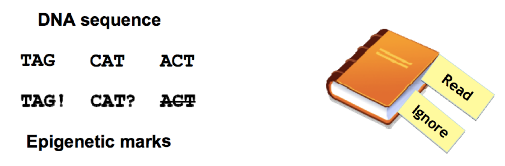
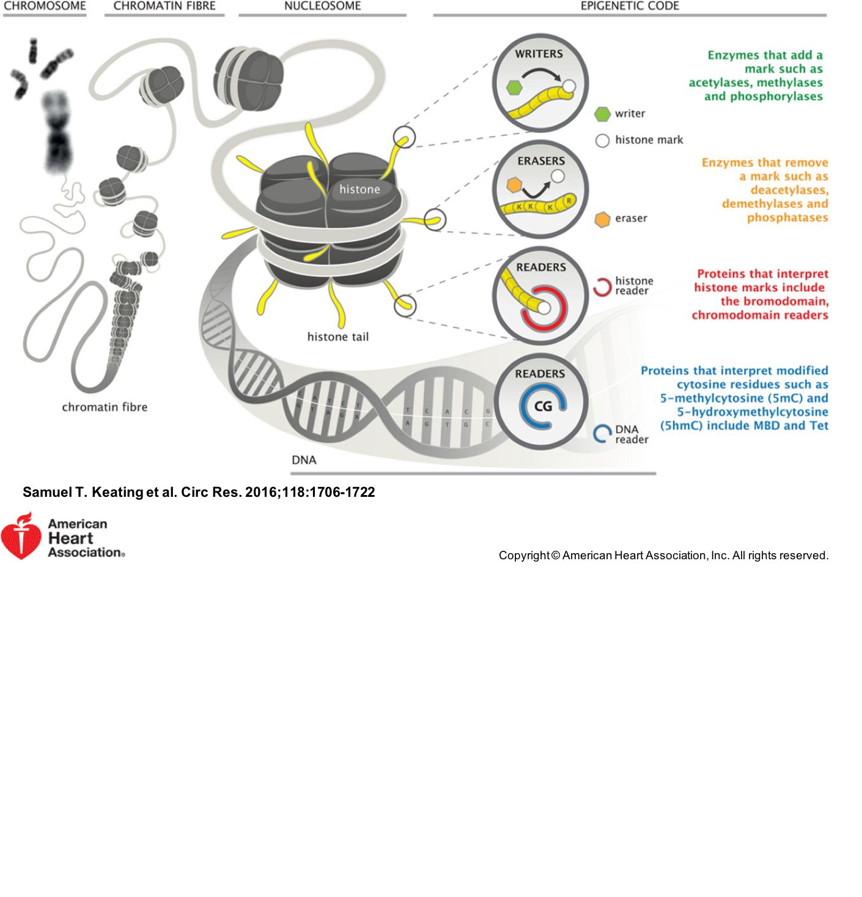
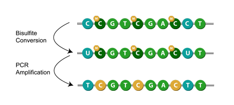
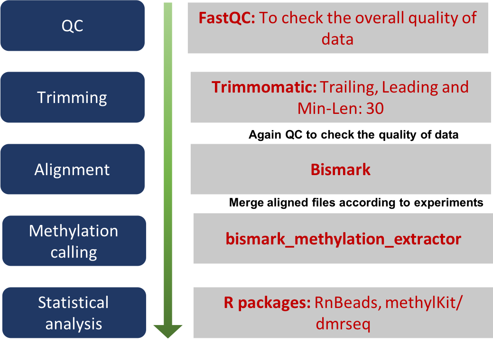
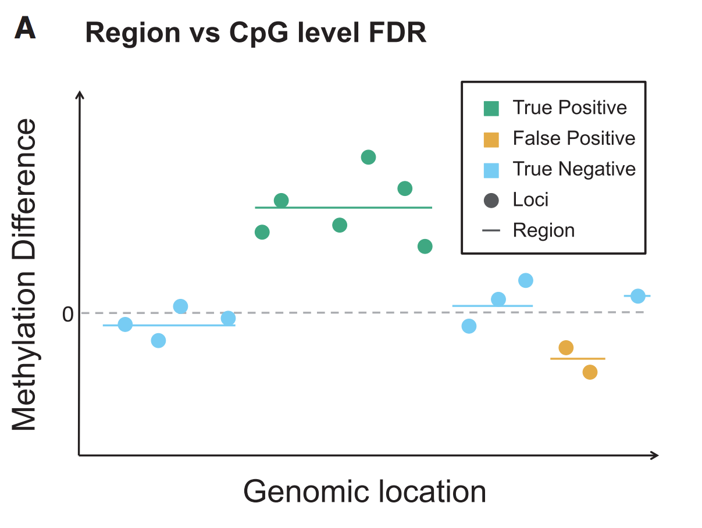
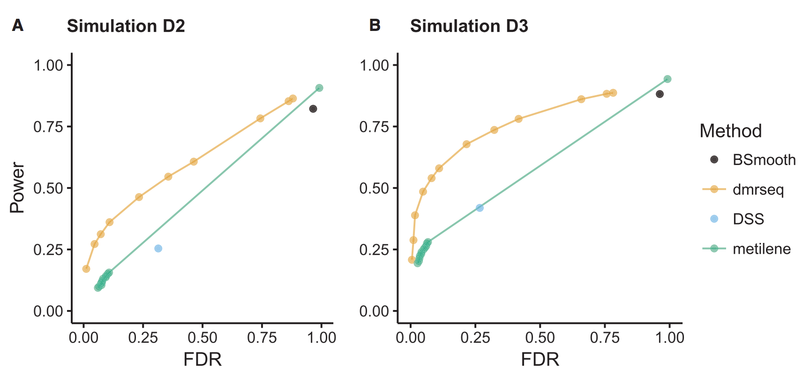
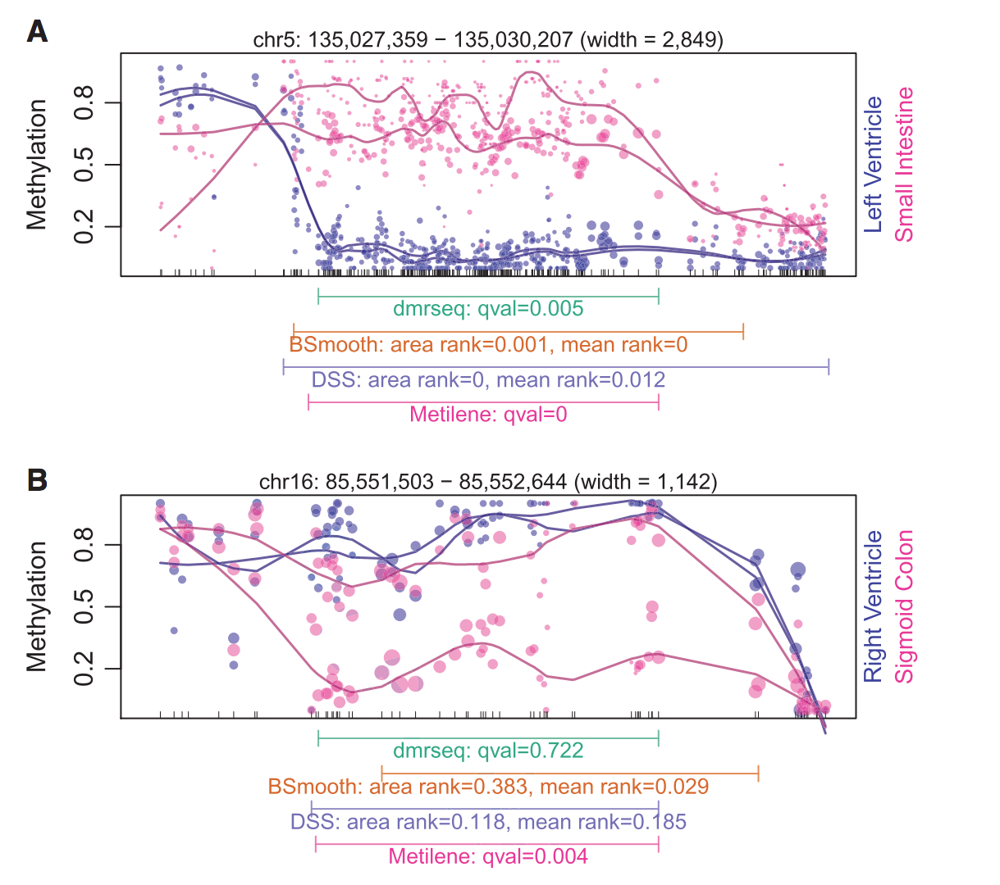

```{r setup, include=FALSE}
options(htmltools.dir.version = FALSE)
```


# Table of Contents

.large[
[dmrseq paper](#3)

<br>
[Epigenetics](#4)

<br>
[Whole Genome Bisulphite Sequencing](#11)

<br>
[Limitations of current methods](#15)

<br>
[dmrseq](#24)

<br>
[Comparison: dmrseq vs other methods](#33)
]
---

class: left

<br>
<br>

# Detection and accurate false discovery rate control of differentially methylated regions from whole genome bisulfite sequencing

.blue[Keegan Korthauer, Sutirtha Chakraborty, Yuval Benjamini,] .red[Rafael A Irizarry]


<i>Biostatistics</i>, kxy007, https://doi.org/10.1093/biostatistics/kxy007

<b>Published:</b> 22 February 2018


---
class: left

# .center[Epigenetics]

A layer of **additional information over genetic information**.

--

.red[**Study of stable heritable changes in gene expression that occur without changes in DNA sequence.**]

--

.center[Epigenetics modification/ marks = Punctuation marks]

--

.center[`bioinformaticianarenotantisocialwearejustgenomefriendly`]

--

.center[.blue[**Bioinformaticians are not anti-social; we are just genome friendly.**]]

--



---


class: center

# Various Epigenetic Modifications




---


class: center

# Whole Genome Bisulphite Sequencing (WGBS)

.pull-left[
### Bisulphite conversion

[ref](https://www.epigentek.com/catalog/dna-bisulfite-conversion-c-75_21_47.html)
]

--

.pull-right[
### Basic Data analysis pipeline

]

.red[Compared to methods developed for RNA-Seq, there are not that many statistical methods available for studying WGBS]

---

class: left

# .center[Applications of WGBS]

<br>

- Detection of Differentially Methylated Regions (**DMRs**)

- Detection of Differentially Methylated Loci (**DMLs**)

- Detection of Copy Number Variations (CNVs)

- Detection of Single Nucleotide Polymorphisms (SNPs)

- Detection of Cytosine methylation levels of Transcription Factor Binding Sites (TFBSs)
---

# .right[....cont]


]
---

class: left

# .center[Limitations of current methods]

<br>

- Methods are greatly hindered by low sample size. Most of the methods depend on large sample sizes.

--

- The number of tests performed = the number of loci analyzed.
<b>Example:</b> Human genome has ~30 million CpGs [1].

--

- Measurements are spatially correlated across the genome [2], but in most methods measurements from all loci are treated independently.

--

- Muliple testing corrections without considering the spatial correlation can result in a loss of power.

--

- DMRs more biologically relevant than DMLs.
---

##.right[....cont.]

<br>
- DML approaches may construct DMRs by chaining together neighboring significant loci, but this type of approach will not yield a proper assessment of the statistical significance of the constructed regions, nor will the FDR be properly controlled [4]. Controlling the FDR at the level of individual loci is not the same as controlling FDR of regions.

--

- Methylation data cannot be modeled neither by Gaussian models (due to low coverage), nor by Binomial models (do not account for biological variability). Beta-Binomial models are computationaly difficult.

--

- Challenges for assessing DMRs:
   - defining region boundaries
   - methods ignore correlation across loci
   - biological variability from sample to sample

---

# .center[FDR at the loci level is not the same as FDR at the region level]

.pull-left[


.content-box-blue[
<b>Genomic location versus methylation difference estimates at several neighboring loci.</b>
]
]


.pull-right[
.content-box-blue[
The individual CpGs (points) are shaded by whether they are a true or false positive. Regions are denoted by lines. 

<b>The loci FDR is:</b>

 .red[FDRloci = (#False Positive Loci) / (Total # of Significant Loci)]
 
<b>The region FDR is:</b>

.red[FDRregion=(#False Positive Regions) / (Total # of Significant Regions)]
]
]

---


# .center[dmrseq] .right[] 

.large[.full-width[.content-box-red[<b>Aim:</b> 

1. To <b>maximize power</b> while <b>controlling the FDR</b> even with sample sizes as small as <b>two samples per condition</b>.


2. To develop a procedure to control FDR at the region level and provide an accurate measure of statistical significance for each region.

]]]

---

# .center[Identification of DMRs by dmrseq]

```{r, echo=F, message=F}
library(DiagrammeR)

grViz("
digraph flowchart {
graph [overlap = true, layout=dot,fontsize=12]
node [shape = box,
  style=filled,
  fillcolor=AliceBlue,
  color=lightBlue2,
  fontsize=12]
 A [label='Detect candidate regions']
B [label='Assessing significance \n of each candidate DMR']
C [label='Estimate FDR']

edge[color=lightBlue2,
  penwidth=5
]
A->B B->C}
")
```

---

# .center[Detecting candidate regions]

.pull-left[
```{r, echo=F, message=F, figure=TRUE, fig.align="left", fig.width=3.5}
grViz("
digraph flowchart {
graph [overlap = true, layout=dot,fontsize=12]
node [shape = box,
  style=filled,
  fillcolor=AliceBlue,
  color=lightBlue2,
  fontsize=12]
 A [label='Detect candidate regions',
  fillcolor=lightBlue2]
B [label='Assessing significance \n of each candidate DMR']
C [label='Estimate FDR']

edge[color=lightBlue2,
  penwidth=5
]
A->B B->C}
")
```
]


.pull-right[
- mean methylation proportion for locus $i$ in condition $s$: $$\pi_{is} = M_{is}/N_{is}$$


- methylation difference of locus $i$ between biological conditions $s$ and $s'$: $$\beta_i = \pi_{is} - \pi_{is'}$$ 


- $\beta_i$'s are smoothed


- candidate regions: segments of genomes with smoothed $\beta_i$'s in the same direction and in absolute value greater than a threshold (e.g. 0.1)
]

---

# .center[Assessing significance of candidate DMRs]

.pull-left[
```{r, echo=F, message=F, figure=TRUE, fig.align="left", fig.width=3.5}
grViz("
digraph flowchart {
graph [overlap = true, layout=dot,fontsize=12]
node [shape = box,
  style=filled,
  fillcolor=AliceBlue,
  color=lightBlue2,
  fontsize=12]
 A [label='Detect candidate regions']
B [label='Assessing significance \n of each candidate DMR',
  fillcolor=lightBlue2]
C [label='Estimate FDR']

edge[color=lightBlue2,
  penwidth=5
]
A->B B->C}
")
```
]

.pull-right[
- methylation counts modeled by Beta-Binomial distribution

- to stabilize the dependence of variance on mean, data are transformed: $$Z_{ijr} =\arcsin{(2M_{ijr}/N_{ijr}-1)}$$

- mean region methylation level can be then estimated using Generalized Least Squares: $$Z_r = X\beta_{0r} + \beta_{1r},$$
with $\beta_{1r}$ being the effect of biological group

]


---

# .center[Assessing significance of candidate DMRs]

.pull-left[
```{r, echo=F, message=F, figure=TRUE, fig.align="left", fig.width=3.5}
grViz("
digraph flowchart {
graph [overlap = true, layout=dot,fontsize=12]
node [shape = box,
  style=filled,
  fillcolor=AliceBlue,
  color=lightBlue2,
  fontsize=12]
 A [label='Detect candidate regions']
B [label='Assessing significance \n of each candidate DMR',
  fillcolor=lightBlue2]
C [label='Estimate FDR']

edge[color=lightBlue2,
  penwidth=5
]
A->B B->C}
")
```
]

.pull-right[
- Estimation of covariance matrix $V_r$:

  - variance dependent on coverage $\rightarrow Var(Z_{ijr}) \approx \sigma^2_r/N_{ijr}$
  
  - correlation of nearby loci $\rightarrow$ modeled correlation by coefficients dependent of the lenght of the interval between the two loci

]


---

# .center[Estimating FDR]

.pull-left[
```{r, echo=F, message=F, figure=TRUE, fig.align="left", fig.width=3.5}
grViz("
digraph flowchart {
graph [overlap = true, layout=dot,fontsize=12]
node [shape = box,
  style=filled,
  fillcolor=AliceBlue,
  color=lightBlue2,
  fontsize=12]
 A [label='Detect candidate regions']
B [label='Assessing significance \n of each candidate DMR']
C [label='Estimate FDR', fillcolor=lightBlue2]

edge[color=lightBlue2,
  penwidth=5
]
A->B B->C}
")
```
]

.pull-right[
- permutation to get an approximate null distribution

- p-value computed by comparing the observed test statistics to the null distribution

]


---

# .center[Data used for comparison]


- six samples of normal human dendritic cells, partitioned into groups of two or three $\rightarrow$ no DMRs, <b>negative control</b>

--


- <b>simulated data:</b> 3000 simulated DMRs added to each data set

  - DMR is created by choosing a cluster of CpGs and simulating the number of methylated reads from a binomial distribution
  - binomial probabilities equal to the observed methylation proportions $\pm$ effect size (approx. 0.1 to 0.5)
 
--

- <b>real data:</b> methylation data from several human tissues and from two mouse strains


---

# .center[dmrseq is more powerful]

.center[power vs. FDR on simulated data]

.center[

]

.footnotesize[.blue[Power is calculated as the proportion of simulated DMRs overlapped by at least one identified DMR. 
FDR is calculated as the proportion of DMRs identified that do not overlap with any of the simulated DMRs.]]
---

# .center[dmrseq performs better]

.center[Examples of real biological data and their ranking by different DMRs identification methods.]

.center[

]


---

class: left

# .center[dmrseq availability]


<br>

- GitHub: [kdkorthauer/dmrseq](https://github.com/kdkorthauer/dmrseq)

- Bioconductor: [dmrseq](https://bioconductor.org/packages/release/bioc/html/dmrseq.html)

---


class: left

# Summary


- Powerful even in the case of 2 samples per group.

--

- Consideration of all possible shorcomings of the available methods for DMRs detection.

--

- Evaluation of the software using experimental data and Monte Carlo simulations.

--

- Implementation in <b>R</b>.

--

- Comparison of the new method with the "famous" methods.

--

- Comparison is not done with <b>RnBeads</b>. Probably because RnBeads performs differential methylation analysis (only) at single nucleotide level.


- Comparison is not done with <b>methylKit</b>, although methylKit performs differential methylation analysis at regional level.

---

# References

[1] Smith Z. D. and Meissner A. (2013). DNA methylation: roles in mammalian development. Nature Reviews Genetics  14, 204–220.

[2] Leek J. T., Scharpf R. B., Bravo H. C., Simcha D., Langmead B., Johnson W. E., Geman D., Baggerly K. and Irizarry R. A. (2010). Tackling the widespread and critical impact of batch effects in high-throughput data. Nature Reviews Genetics  11, 733–739.

[3] Aryee M. J., Jaffe A. E., Corrada-Bravo H., Ladd-Acosta C., Feinberg A. P., Hansen K. D. and Irizarry R. A. (2014). Minfi: a flexible and comprehensive Bioconductor package for the analysis of infinium DNA methylation microarrays. Bioinformatics  30, 1363–1369.

[4] Robinson M. D., Kahraman A., Law C. W., Lindsay H., Nowicka M., Weber L. M. and Zhou X. (2014). Statistical methods for detecting differentially methylated loci and regions. Frontiers in Genetics  5, 324.


---

class: center

<br>
<br>
<br>
<br>

.eLarge[**Thank you!**]